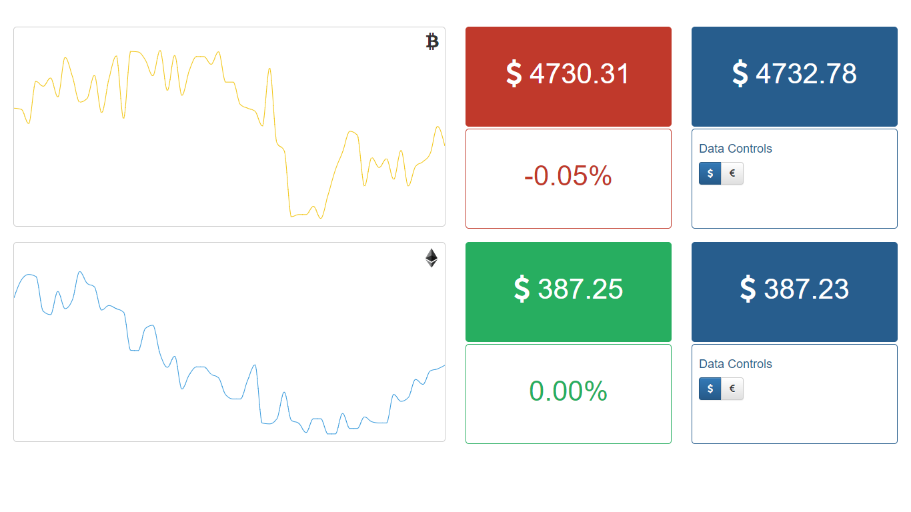

# Coingraphs

[](https://github.com/derogab/coingraphs)
[](https://github.com/derogab/coingraphs)
[](https://github.com/derogab/coingraphs/stargazers)
[](https://github.com/derogab/coingraphs/network)
[](https://github.com/derogab/coingraphs/issues)

Coingraphs is a **real-time graphs for cryptocoins**.



**Dependencies**
```shell
# Install dependencies
sudo apt-get install apache2 php5 libapache2-mod-php5 php5-mcrypt mysql-server php5-mysql python python3

# Install python dependencies
pip install json requests sys time
```

**Download**

```shell
# Open the apache folder
cd /var/www/

# Clone the repo
git clone https://github.com/derogab/coingraphs
```

**Configuration**

Open `getdata.php` and `getdata.py` to customize mysql db connection.

**Cronjob**

Insert a cronjob. You can edit your cronjob list by writing `crontab -e`. 
```
*/1 * * * * /usr/bin/python /var/www/coingraphs/getdata.py
```

**Usage**

Open `http://localhost/coingraphs` to view real-time graphs.

**Donate**

If this project help you reduce time to develop, you can [give me a cup of coffee](https://www.paypal.me/derogab) :) 
