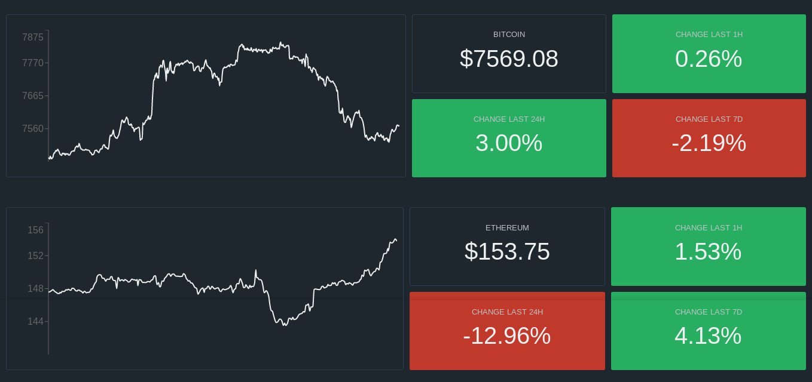

# Coingraph

[](https://github.com/derogab/coingraph)
[](https://github.com/derogab/coingraph/releases)
[](https://travis-ci.com/derogab/coingraph/)
[](https://github.com/derogab/coingraph/stargazers)
[](https://github.com/derogab/coingraph/network)
[](https://github.com/derogab/coingraph/issues)


Coingraph is a **real-time graph for cryptocurrencies**.



## Dependencies
```shell
yarn
```
And don't forget to also install the [daemon dependencies](./daemon/README.md#dependencies)!

## Configuration
If necessary, view the [daemon configurations](./daemon/README.md#configuration).

## Usage
```shell
yarn run all
```
The previous command starts both the [daemon](./daemon) and the web interface.

## Docker
#### Manual
1. [Start the `coingraph-daemon`](./daemon/README.md#start-container) and then
2. Run the container
    ```shell
    docker run -d \
      -p 3000:3000 \
      --link DAEMON_CONTAINER_ID \
      derogab/coingraph-client
    ```

#### Using `docker-compose` 
Open `docker-compose.yml` and eventually change environment variables. And then
```shell
docker-compose up -d --build
```

## License
[_Coingraph_](https://github.com/derogab/coingraph) is made with ♥  by [derogab](https://github.com/derogab) and the [amazing dev team](https://github.com/derogab/coingraph/graphs/contributors). It is released under the MIT license.
