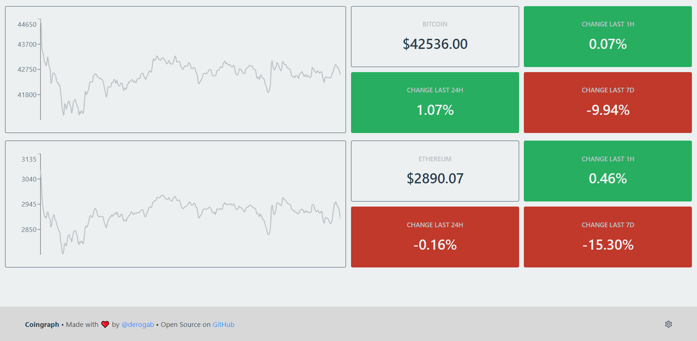

# Coingraph

[](https://github.com/derogab/coingraph/releases)
[](https://github.com/derogab/coingraph/actions/workflows/docker-publish.yml)
[](https://github.com/derogab/coingraph/stargazers)
[](https://github.com/derogab/coingraph/network)
[](https://github.com/derogab/coingraph/issues)
[](https://github.com/derogab/coingraph/blob/master/LICENSE)

Coingraph is a **real-time graph for cryptocurrencies**.



## Dependencies
```shell
npm install
```
And don't forget to also install the [daemon dependencies](./daemon/README.md#dependencies)!

## Configuration
If necessary, view the [daemon configurations](./daemon/README.md#configuration).

## Usage
```shell
npm run all
```
The previous command starts both the [daemon](./daemon) and the web interface.

## Docker

[](https://github.com/derogab/coingraph/releases)
[](https://github.com/derogab/coingraph/actions/workflows/docker-publish.yml)
[](https://hub.docker.com/r/derogab/coingraph-client)

#### Manual
1. [Start the `coingraph-daemon`](./daemon/README.md#start-container) and then
2. Run the container
    ```shell
    docker run -d \
      -p 3000:80 \
      --link DAEMON_CONTAINER_ID \
      ghcr.io/derogab/coingraph-client
    ```

#### Using `docker-compose` 
Copy `.env.template` to `.env`. Eventually change environment variables and then start one of the following.
###### Production 
```shell
docker-compose up -d
```
###### Development
```shell
docker-compose -f docker-compose.dev.yml up -d 
```
###### Build 
```shell
docker-compose -f docker-compose.build.yml up -d --build
```

### Tip
If you like this project or directly benefit from it, please consider [buying me a coffee](https://derogab.com/donate).

## License
[_Coingraph_](https://github.com/derogab/coingraph) is made with ♥  by [derogab](https://github.com/derogab) and the [amazing dev team](https://github.com/derogab/coingraph/graphs/contributors). It is released under the MIT license.
